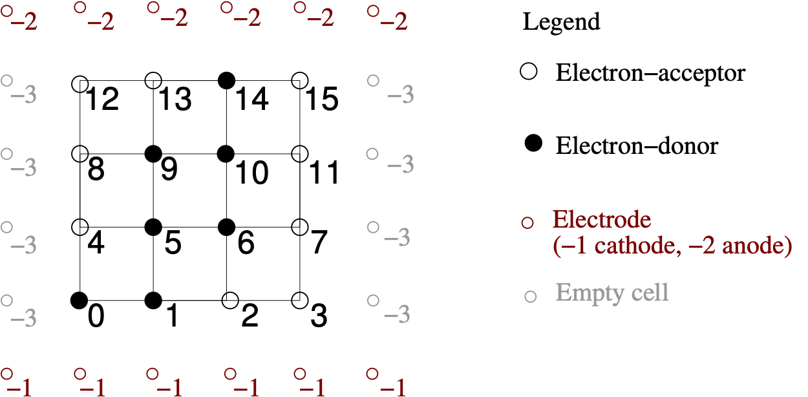

.. _pyGraspiInputs:

==============================================
Inputs
==============================================

**py-graspi** supports two input formats: one for structured data and one for unstructured data.
For structured data, the dimensions of discrete points along each axis :math:`n_x, n_y, n_z` must be specified in the first line of the input file. The rest of the file contains a row-wise representation of the corresponding matrix, listing the phases using labels from the available set. This data is organized as a single, contiguous block in row-major order (also known as "C order"). Because the data is structured, graspi can build the local neighborhood as it processes the input.

The input file for the above figure

.. literalinclude:: imgs/structuredExample.txt
    :linenos:
    :language: none

Note that the first row is considered to be adjacent to the cathode (BLUE meta-vertex), while the last row is considered to be adjacent to anode (RED meta vertex).

The second format corresponds to unstructured data, where information about
phases needs to provided along with the neighborhood. The input file start with the total number of vertices in the data set.
Next each line provides the information about each vortex.
First the index of the vertex is provided followed by the color of the vertex.
The reminder of the line consist of triplets with information about the neighbors.
The triplet consists of the index of the neighbor, the distance from to the neighbor and type of the neighbor.
In this example, two types of neighbors are considered: ``f``, ``s`` and ``t`` that
corresponds to first-, second- and third-order neighbors, respectively.
The set of types may be redefined to encode additional information.

.. literalinclude:: imgs/unstructuredGraph.graphe
    :linenos:
    :language: none
